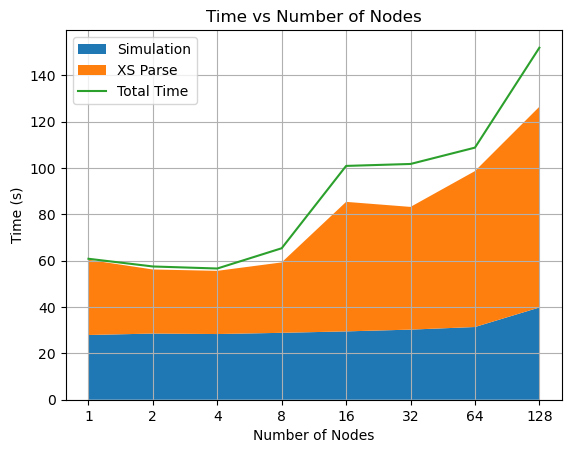
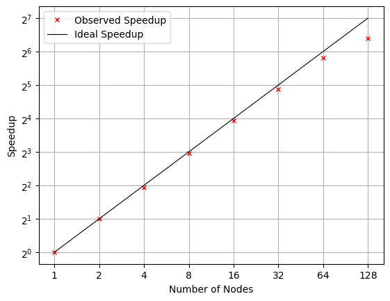

As part of my Parallel Computing course work, I conducted a scalability and performance study of [**Abeille**](https://github.com/HunterBelanger/abeille), an open-source Monte Carlo neutron transport code, on NERSC’s [**Perlmutter**](https://www.nersc.gov/what-we-do/computing-for-science/perlmutter) supercomputer. The goal was to understand how well Abeille scales to leadership-class systems and to remove the primary bottlenecks that limit large-scale simulations.

*Figure: Time taken by various phases of Abeille simulation as the number of nodes increases. The nuclear data parsing phase (orange) becomes the dominant bottleneck at scale.*

We found that while Abeille’s transport kernel scales well, reading dozens of small nuclear data files (ACE format) from the parallel filesystem becomes a significant bottleneck at scale - when run of many MPI ranks. To address this, we developed and evaluated two strategies: 
1. consolidating ACE files into a single file using **ADIOS2** or **HDF5 (using HighFive)** for parallel reading, and 
2. reading the data on a single MPI rank and broadcasting it to all ranks.

## Key findings

- The **PowerIterator** (particle transport) phase shows strong scaling up to 64–128 nodes when particle counts per thread are sufficient.
- Overall weak scaling degrades beyond ~16 nodes due to **filesystem I/O saturation** during ACE parsing.
- Using ADIOS2 or HighFive to read from a single file reduces parsing time from **>25 seconds to <1–2 seconds**, a **25×–50× speedup**.
- **ADIOS2 (BP5)** delivered the best performance and slightly reduced data size (~28 GB → ~26 GB).
- At higher MPI counts, disk contention reappears; the **single-rank read + MPI broadcast** approach scales best, achieving ~**4 seconds** parsing time up to **256 ranks** on Perlmutter.

*Figure: Strong scaling of the Adios2 based reader.*

This study demonstrates that consolidating nuclear data into a single file and limiting I/O to a small number of MPI ranks—rather than having all ranks read independently—can significantly improve scalability on large HPC systems. While the results are presented using Abeille, the underlying issue and solution are broadly applicable to other Monte Carlo transport codes such as OpenMC, which rely on similar nuclear data libraries and I/O patterns. These improvements are especially important for coupled multiphysics simulations that require many repeated Monte Carlo solves, as well as for depletion calculations where large numbers of cross-section files must be read at every step. A key next step is to evaluate these approaches in fully in-situ workflows within Abeille and OpenMC to confirm that the same performance benefits persist in realistic coupled and production-scale simulations.

*Note: Read the full project report by pressing the **PDF** button above for more details.*

---

*This work was carried out on NERSC’s Perlmutter system with guidance from Prof. Jacob Merson and Prof. Hunter Belanger.*
